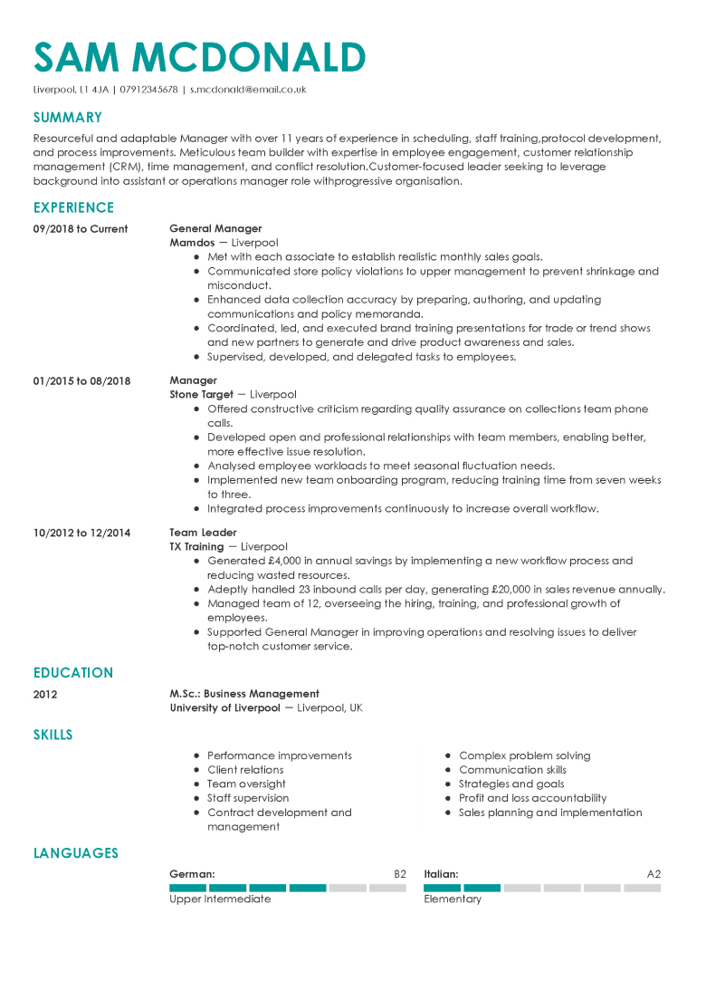
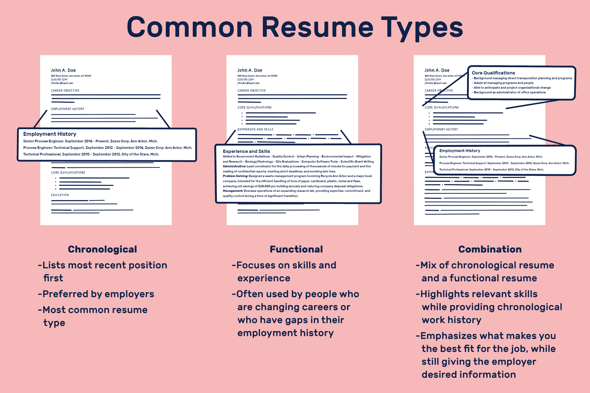
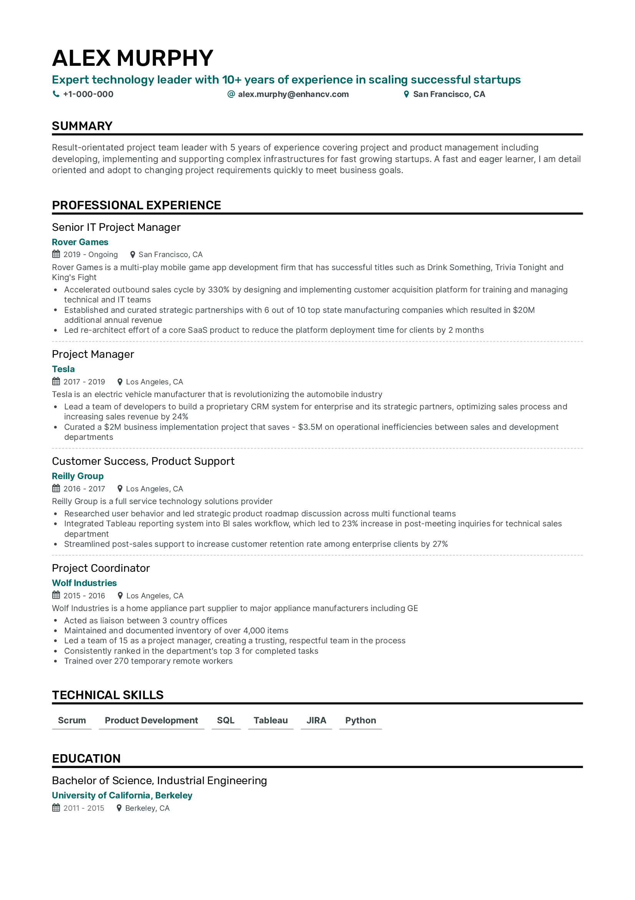
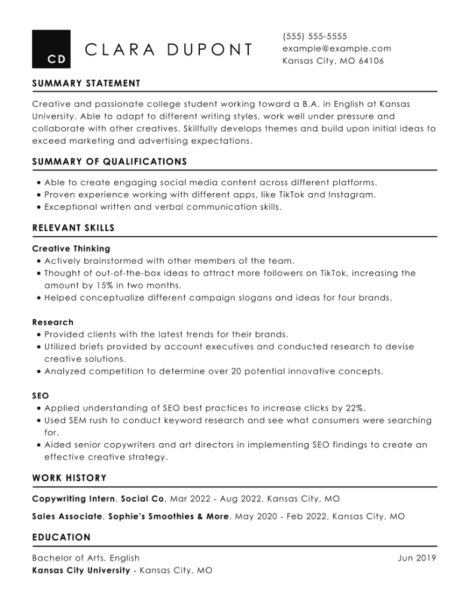
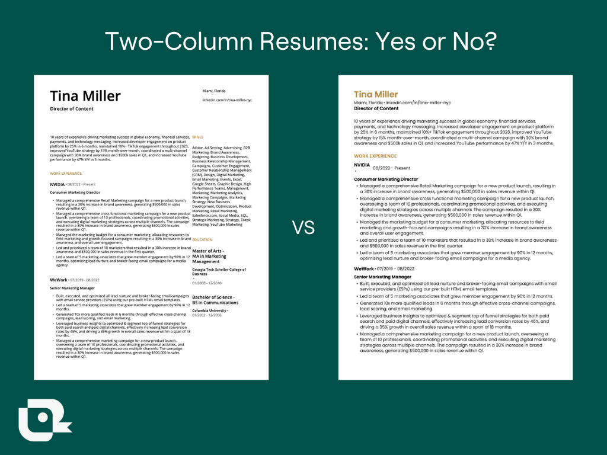
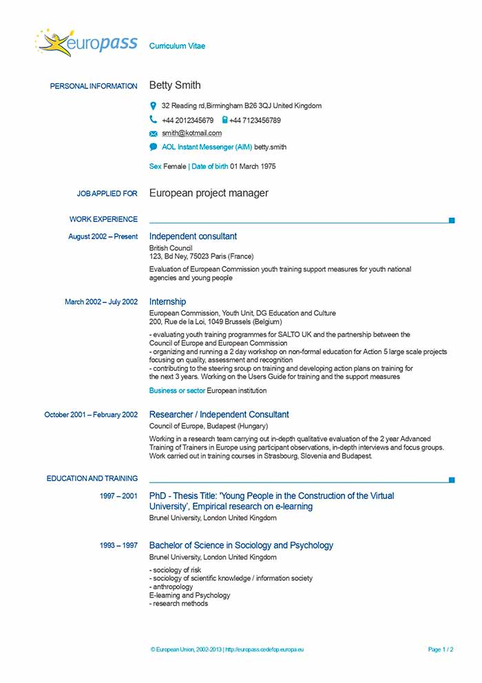

### Introduction

[Content wise](#content-wise-styling), and [Visualization wise](#visualization-styling), there are different category of resume.

Combination of all content and visualize category, would produce different structure. However, I'd go with Chronological vertical one column resume, as an example.

A very good example for all guidelines you'll read in this page:

### General guideline and formatting

- ✅ First comes your name, then your job title on top of your resume, with big fonts
- ✅ Use black color for your fonts only, titles can be in another color but the main's context must be in black.
- ✅ Save your resume with your name, alongside the day you generated it, this can help the recruiter understand that you have customized your resume for the job. For example, you may write ManiMozaffar_2022-07-25
- ✅ First comes the position, second comes the company's name. Make sure to follow that order. Same goes for university, first degree's subject's name, second university's name
- ✅ Date is better to be written as MM/YYYY all around your resume, like 02/2020
- ✅ Use between 475 to 600 words in your resume
- ✅ Generally write your texts in bullet points except for summary section.
- ✅ Best resume font sizes are: 11-12pt for normal text, 14-16pt for section titles and headers
- ✅ Better write your resume in 1 page if you have less than 7-10 years experience, otherwise write 2 pages
- ✅ Use proper spacing, so that it'd be friendly to the eye when reading. Dates and name of companies you worked in, and each sections should be recognizable with one glance.
- ✅ Include relevant experience, even if it is not paid work
- ✅ Include a summary or objective statement at the top of your resume. This can help the hiring manager quickly understand what you have to offer and why you are a good fit for the job. Follow the section related ot it to understand how to write one.
- ✅ Make sure your jobs don't overlap with each other or other experiences, such as teaching, the only overlap that is allowed is Work Experience with Education.
- ✅ Start with your most recent or current position and work backward
- ❌ Don't list every job you've ever had - only include relevant experience that showcases your skills and achievements
- ✅ Emphasize your unique related value proposition or memberships

      - 👍 Contributed to the development of several open-source Python projects, including Django Rest Framework and Pandas.

- ✅ Write minimum 2 bullet points, maximum 6-7 per job. If you have more than 6-7, then you should consider merging them.

### Example Structure

A Chronological vertical one per row usually follow such order:

1. Your personal data
2. Summary
3. Skills
4. Working experience
5. Education Section (if you have)
6. Other optional sections (projects, awards, certificates, etc)
7. Referral Letter if you have (Usually in second page)

!!! tip "Orders within one section"

    Per each section, you might have multiple entry. For example working experience, you might have worked for few companies.
    The order for each row should be by date, your latest entry should be on top. That means your recent job should be the first work experience.

### Bullet points

#### Definition

In typography, a bullet or bullet point, •, is a typographical symbol or glyph used to introduce items in a list. For example: • Item 1 • Item 2 • Item 3 The bullet symbol may take any of a variety of shapes, such as circular, square, diamond or arrow.

#### Rules to follow when writing bullet points

- ✅ **VERY IMPORTANT**: Use bullet points to list your responsibilities and achievements for each job, you can testify this by asking how and why, and if it answers then it's a good responsibility and achievements. So a task is something that's either one of your normal job duties, something you've bee assigned to handle, or something you've chosen to do yourself. An achievement is something you've accomplished or have been recognized for.

      - 👎 • Refactored the backend's code (Why?)
      - 👎 • Improved better coding readability, easier maintenance and development (How?)
      - 👍 • Refactored the backend's code for better coding readability, easier maintenance and development

      - 👎 Answered customer's calls everyday, and resolved a thousand ticket (day-to-day task)
      - 👎 Implement a notification system (one time task)
      - 👍 Implemented a notification system that increased user engagement by 20% (achievement)

- ✅ Use correct grammar and professional language; use Grammarly to find grammar mistakes.
- ✅ Apply past tense and passive voice for all sentences except in the summary/about me section.
- ✅ Limit each bullet point to one or two lines, no more.
- ✅ Use third person view when writing your resume.

      - 👎 "I am a developer, a backend developer with 5 years of experience."
      - 👍 "A backend developer with 5 years of experience."

- ✅ Use proper action verbs while avoiding weak verbs such as `did`.

      - 👎 "Created a new software system that increased productivity by 20%."
      - 👍 "Implemented a new software system that increased productivity by 20%."

- ✅ Quantify your achievements. Use numbers and percentages to highlight your achievements and show the impact of your work. **AVOID BULLSHITING NUMBERS!** Make sure you have a very strong argument that can justify the number in your resume, and also during interview. **Usually resumes with too many numbers would be instantly rejected, so again don't overdo it!**
- ✅ **Remember that the HR team will first read your bullet points, if it's too hard to follow, then it's not a good one. Make sure the achievements are understandable to HRs. For example, I provided enough information regarding why I did it (efficiency and high volumes for systematized transactions) and how I did it (PostgreSQL replication, indexing, and materialized views). The how should be enough information to satisfy a technical person, and why should be enough information to satisfy a non-technical person such as HR**

      - 👎 • Used replication, indexing, and materialized views
      - 👍 • Constructed a systematized transaction system with PostgreSQL replication, indexing, and materialized views, for efficiency and high volumes

- ❌ Avoid using synonym alongside each other. Be very mindful about the context you're writing, don't spam words. Try to be straight to point.

      - 👎 A collaborator team-player backend developer with 5 years industry experience in backend engineering.
      - 👍 A team-player backend developer with 5 years experience.

- ❌ Do not use vague or unclear language. Your resume should be written in clear and concise language that accurately conveys your skills and experience. Avoid using overly technical terms or jargon that may not be familiar to the reader.
- ❌ Avoid using emoji or too colorful designs as it decreases the 6 second impression, keep your resume simple
- ❌ Avoid using chatGPT, as AI text is detected by ATS.
- ❌ Don't exaggerate or embellish your accomplishments, but also don't be too modest

      - 👎 • Single-handedly developed and launched a new product that generated millions in revenue
      - 👍 • Collaborated with a team to develop and launch a new product that generated significant revenue

- ❌ Avoid using vague or generic language, and be specific about what you achieved

      - 👎 • Managed a project to completion
      - 👍 • Successfully led a cross-functional team to complete a project ahead of schedule and under budget, resulting in a 20% increase in productivity

### Content-wise styling

There are several different styles of resumes, each with their strengths and weaknesses.

Here are some of the most common resume styles

#### Chronological

This style lists your work experience in reverse chronological order, starting with your most recent position, and follows your achievements for each role. It is a traditional format that is easy to read and understand, but may not be ideal for candidates without employment history or those who have changed careers.

??? info "Click to Expand the Example Chronological Resume"

    

#### Functional

This style emphasizes your base skills, rather than your work experience. It can be useful for candidates who are changing careers to irrelevant field or have no work experience, but may not be ideal for those with a strong work history.

!!! danger "Don't use Functional if you can"

    It's best to avoid functional resume. Only use it if you're applying for an internship and you have no previous working experience/similar projects you can showcase.
    They're not ATS friendly, and HRs and technical people avoid them, because due to high competition they prefer reviewing with candidate who can actually present some core job skills.

??? info "Click to Expand the Example Functional Resume"

    

#### Combination

This style combines elements of the chronological and functional styles, highlighting both your skills and work experience. It can be a good choice for candidates with diverse experience or those who are looking to showcase specific achievements.

!!! danger "Don't use Combination if you can"

    Some people have very limited working experience, hence make it harder for them to write one page chronological resume. Combination may fit them best. from HR or ATS perspective, it's way more preferred than Functional. But it's still not very common, and most people use Chronological, which works the best in my opinion.

### Visualization styling

#### One Column

This style uses one section per row.
It features a single column of information that is organized in a clear and easy-to-read format.

??? info "Read also about EuroPass CV"

    Europass is a European Union initiative to increase transparency of qualifications and mobility of citizens in Europe. It aims to make a person's skills and qualifications clearly understood throughout Europe

    

#### Two Column

This style uses two section per row.

!!! tip "My personal option regarding which styling option to go with"

    Between these two styles, the vertical resume with one column is often considered the best choice. It is a modern and visually appealing format that is easy to read and understand. The single column layout keeps the information organized and allows for clear section headings, making it easy for recruiters to quickly scan the resume for relevant information.
