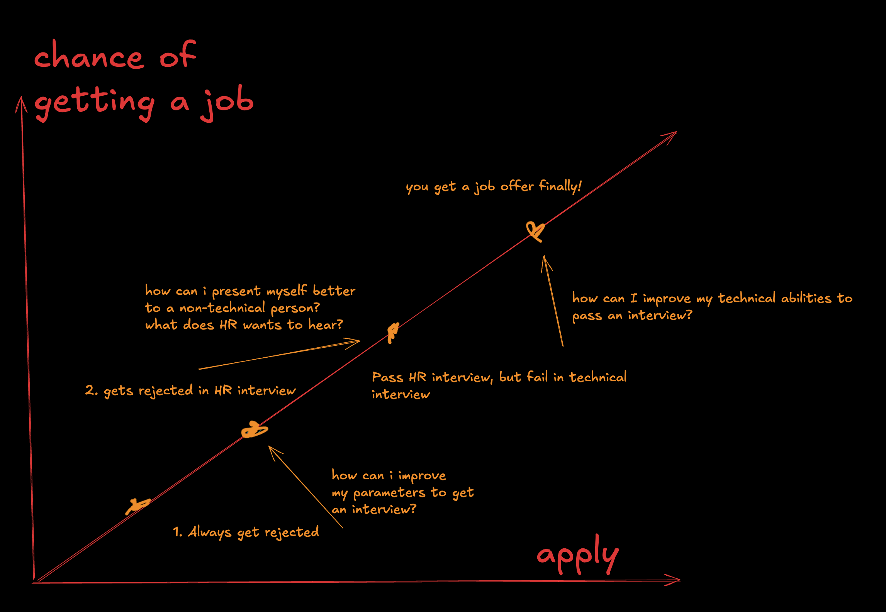

# Getting Started with Awesome Resumes

Welcome to the **Awesome Resumes** project! This guide will walk you through how to use this repository to craft a professional resume. Whether you're entering the job market for the first time or are an experienced professional, the quality of your resume is key to securing interviews and job offers.

!!! tip "Support this project!"

    If you find this project helpful, please consider giving it a star on [GitHub](https://github.com/ManiMozaffar/awesome-resumes). It makes other people discover this project and benefit from it. It also motivates me to keep maintaining it!

!!! danger "Scary fact!"

    Did you know that only 1 in 50 resumes get an interview? That's a 2% chance of getting an interview. This is why it's crucial to have a well-crafted resume that stands out from the rest.

## Why This Project Matters

In today’s competitive job market, a well-crafted resume is essential. It’s not just about listing your skills and experiences; how you present that information can make or break your chances of getting noticed. You can be a very senior person, with years of experience, but with a poorly self presentation, you can be easily overlooked. Or you may be a junior/intern with a very well crafted resume, and you can be easily noticed. This is why it's crucial to have a well-crafted resume.

### The Job Search Formula

Your chances of getting a job can be broken down into a simple formula:

Chance of Getting a Job = Location _ Quality of CV _ Quantity of Applications

- **Location**: The job market varies by region, industry, and even by company. Your location affects the number of opportunities available.
- **Quality of CV**: A strong, well-designed resume increases your chances of landing interviews. This is where this project can have the most significant impact.
- **Quantity of Applications**: Applying to more jobs increases your chances, but only if those applications are well-targeted and relevant.

You may not be very in control of the location, But you can control the quality of your CV and the quantity of applications. Make sure to find the right balance between quality and quantity, and you will increase your chances of getting a job.

This project focuses on improving the **quality of your CV**, giving you the best shot at getting your foot in the door.

## Understanding the Job Search Process

The image below, `chance_of_getting_job.png`, provides a visual representation of the job search process:

### Diagram Explanation

The diagram shows the typical steps in the job application process, each representing a hurdle you must overcome:

1. **Always Get Rejected**: This is the initial stage where poor resume quality results in rejections, often without any feedback. Here, it's crucial to ask, "How can I improve my parameters to get an interview?" This is where our project helps the most.
2. **Rejected in HR Interview**: If you do get an interview, the next challenge is impressing non-technical HR staff. You must present yourself effectively, understanding what HR looks for.
3. **Fail in Technical Interview**: Even if you pass the HR stage, the technical interview is the next hurdle. This requires technical proficiency beyond what’s on your resume.
4. **Get a Job Offer**: Finally, if you succeed in both interviews, you get a job offer.

### Project Scope

This repository primarily helps with the **first stage**: getting you past the initial resume screen and into the interview room. While it’s up to you to clear the HR and technical interviews, the quality of your resume is what will get you those opportunities.

## Next Steps

1. **Understand the definition**: Understand the definitions and words used in the entire guidelines.
2. **Learn about structure**: Learn about the structure of the resume and how to organize your content. There is a separate guide for this.
3. **Learn about each section individually in deep**: Learn about each section in detail and how to write them. There is a separate guide for each section.
4. **Understand strategies**: Understand the strategies to make your resume stand out.
5. **Start crafting your resume**: Pick up a template and start crafting your resume.

Let's get started and take the first step towards your next job opportunity!
