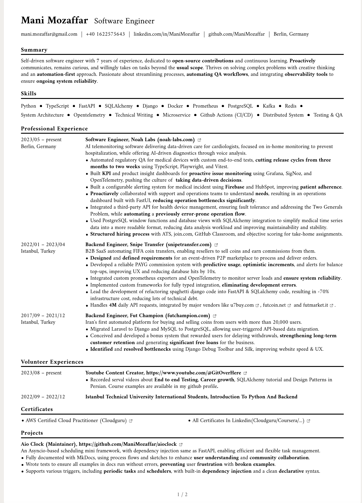
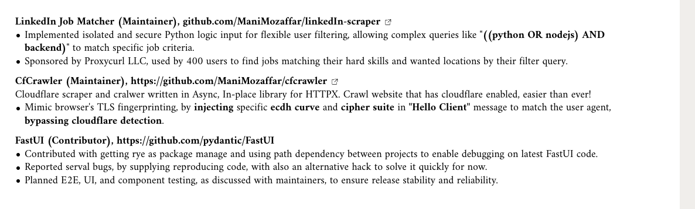

# Samples

## Contribution

You can make a contribution by adding your resume to the `samples` folder.
After that, I can even review your resume and give you feedback on it, while putting it on the documentation so others can see as well. If you wish to hide your personal information, you can do so by replacing them with dummy data. It is no shame if your resume is not perfect. My first resume was a mess, but I learned from it and improved it over time. I believe my first version of resume might be even in commit history, don't be shy if your resume is not perfect. No one cares about an old resume after few months, and all companies following data protection laws will delete your resume after a certain period of time. So don't worry about it, and share your resume with us!

## Backend Engineer

### Mani Mozaffar

I cannot review my own resume, but I can share it with you.

??? info "Expand to view"

    
    
