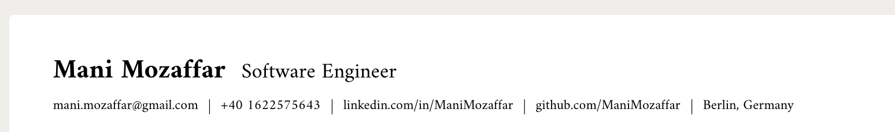

# Personal Information on Your Resume: What to Include (and What to Skip)

As a general rule, first make sure that a reader won't lose any content if they print your resume. For example if providing linkedin, make sure you also write the URL next to it instead of just using hyperlinks. Keep the section clean and simple. Use icons sparingly, if at all, to avoid issues with Applicant Tracking Systems (ATS).

## What to Include

### 1. **Your job title**

This is the first thing a recruiter will see, so make it count. Use the job title you’re applying for, or a similar one that reflects your skills and experience. For example, if you’re applying for a software engineering role, your title could be “Software Engineer” or “Full Stack Developer.”

### 2. **Full Name**

Use your full legal name, as it appears on your ID. Avoid nicknames or shortened versions. This is your professional document, so keep it formal.

### 3. **Phone Number**

List your personal mobile number, and make sure it’s accurate. Don’t include your work number—it's unprofessional and risky, especially if your current employer isn’t aware you’re job hunting.

### 4. **Email Address**

Your email should be professional and include your name. Avoid quirky usernames like `coolguy123@whatever.com`. If needed, create a new email just for job applications.

### 5. **Location**

You don’t need to put your full address. Just your city and state (or country) are fine. This helps recruiters know your general location without risking privacy issues.

### 6. **LinkedIn Profile**

If you have a LinkedIn profile, include the URL, but make sure it’s customized and up to date. This gives recruiters more insight into your professional background.

### 7. **Github, Portfolio or Relevant Links**

If you’re in a creative or tech field, linking to a portfolio, GitHub, or personal website is a good move. Just make sure it’s relevant to the job you’re applying for.

## What to Leave Out

### 1. **Social Security Number (SSN)**

Never include your SSN or any other sensitive personal identification numbers. It’s not required and is a security risk.

### 2. **Date of Birth, Gender, or Marital Status**

These details are unnecessary and can lead to bias. Modern resumes focus on your skills and experience, not personal characteristics.

### 3. **Photo**

Unless you’re applying for a role where your appearance is directly relevant (like acting or modeling), leave your photo off. It’s not needed and can open the door to discrimination.

### 4. **Nationality or Place of Birth**

Skip these unless specifically required for a job that needs citizenship verification, such as government roles.

## General rule:

- ✅ **First comes the country name, second comes the city name where you live.**
- ✅ **Use hyperlinks for your contract information**
- ✅ **Must include LinkedIn and maybe GitHub or alternative platforms**
- ✅ **A good photo is better than no photo, and no photo is better than a bad photo. A good photo is considered as you wearing professional clothes, such as a suit.**

- ❌ **Don't Share personal information such as age, religion, political views, or exact address information**

      - 👎 A 22 year old experienced backend developer
      - 👍 A backend developer with 5 years experience

- ❌ **Don't Use unprofessional language or tone**

      - 👎 Really interesting helping out with open-source stuff. Like for serious, super pumped about it
      - 👍 Passionate about open source contribution

## Example

Check below screenshot for a sample personal information section on a resume:

