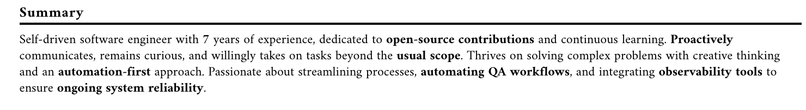
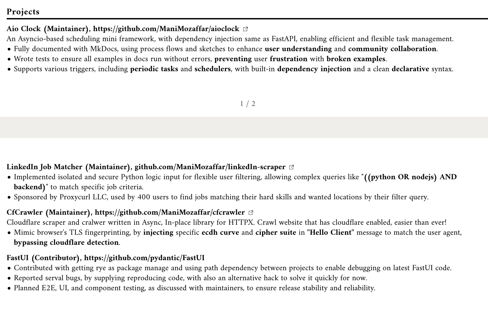
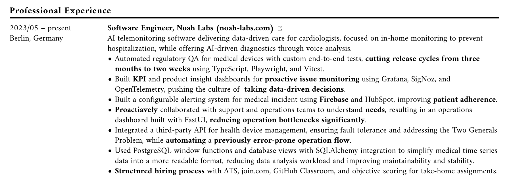

# Writing a Killer Resume Summary

Your resume summary is **the first thing** most recruiters see, and often it’s the only part they focus on before deciding whether to keep reading or toss your resume aside. That means your summary needs to hit hard, be unique to you, and set you apart from the pack.

## What Is a Resume Summary?

A resume summary is a brief paragraph (usually 3-4 sentences) at the top of your resume that highlights your key skills, experience, and what makes you stand out as a candidate. It’s your elevator pitch—quick, impactful, and straight to the point.

## Why Is It So Important?

Most HR professionals spend only a few seconds scanning a resume, and your summary is their first impression. If your summary is vague or generic, they’ll move on. On the other hand, if it’s specific and backed by the rest of your resume, it can hook them in and make them want to learn more about you.

## How to Write a Great Summary

### 1. **Make It Personal and Specific**

Your summary should reflect who _you_ are, not just someone in your industry. Avoid clichés like "hard-working" or "team player"—these can be stuck onto anyone's resume. Instead, focus on what makes you different. Mention unique skills, experiences, or achievements that showcase your strengths.

### 2. **Support It with Your Resume**

If you describe yourself as "curious" or "innovative," make sure the rest of your resume backs that up with concrete examples. Your summary should be a preview of the details that follow, not just a list of buzzwords.

### 3. **Tailor It to the Job**

One-size-fits-all doesn’t work here. Customize your summary for each job you apply to by highlighting the skills and experiences most relevant to that specific role. This shows recruiters you’re serious about the position and not just shotgun-applying.

## Common Mistakes to Avoid

- **Being Too Vague**: Don’t just say you’re "experienced" or "skilled." Specify what you’ve done, how you did it, and the results.
- **Overloading with Keywords**: While it’s important to use keywords from the job description, don’t overstuff them. It should still read naturally
- **Copying Others**: Your summary should be unique. Don’t lift phrases from other resumes or online examples without making them your own. **Your summary defines you, and only you!**

## A Perfect Example

I think my summary is very solid. Check the below screenshot.

### Understanding why?

Let's walk through the example above:

- **Self driven:** I have no educational background in computer science, but I taught myself to code, and this proves I’m self-driven.
- **Dedicated to open source projects:** Through my CV, I have shown 5 open source project I have worked on.

??? info "Expand to see my open source contributions"

    

- **Proactively communicates...:** In my latest working working experience as you can see in below screenshot, I have showcased that I have been actively communicating with Operation team.

??? info "Expand to see my last working experience"

    

- **Curious, and willingly takes on tasks beyond the usual scope:** I have showcased this in my entire resume. From the above screenshot, you can see me working on Crawlers, security, data science, business intelligence, devops, and more.

- **Thrives on solving complex problems with creative thinking and an automation-first approach:** I have showcased this in my entire resume again, where I automate a lot of workflows even applying for jobs (I wrote a linkedin bot that does this). You can see the screenshot above (either work experience or open source contributions).

- **Integrating observability tools to ensure ongoing system reliability:** I have showcased using Signoz, opentelemetry, prometheus and grafana in my resume. You can find one example in last work experience which I already showed you above.

!!! tip "Why this summary is unique to me?"

    Can you put these into your own summary? Probably not. So that's why this summary is very unique to me, and only me. It's not a copy-paste from somewhere else, and it's not a generic summary that could apply to anyone. It's specific, personal, and backed by the rest of my resume.

## Some General Tips

- ✅ **Your summary must only defines you, and only you! Check the example to understand this better**
- ✅ **Write about 2-4 lines**
- ✅ **from third person view perspective**

      - 👎 I am a developer a backend developer with 5 years experience cc
      - 👍 A backend developer with 5 years experience

- ❌ **Don't Share personal information such as age, religion, political views, or exact address information**

      - 👎 A 22 year old experienced backend developer
      - 👍 A backend developer with 5 years experience

- ❌ **Don't Include irrelevant information or hobbies**

      - 👎 Passionate about psychology
      - 👍 Passionate about open source contribution

- ❌ **Don't Use unprofessional language or tone**

      - 👎 Really interesting helping out with open-source stuff. Like for serious, super pumped about it
      - 👍 Passionate about open source contribution

- ❌ **Don't put the focus on only your skills, this is general information and a quick summary of your resume not your skill lists**
- ❌ **Avoid mentioning any soft skills directly or indirectly; unless it's been under the hood of your job title (Lead developer, CTO, Founder, etc)**
- ### Work Experience

## Final Thoughts

Your resume summary is like a handshake at the start of an interview—it sets the tone. Make it count by being specific, personal, and backed by the rest of your resume. Tailor it to each job, and avoid generic statements that could apply to anyone. Remember, this is your chance to make a lasting impression in just a few lines.
