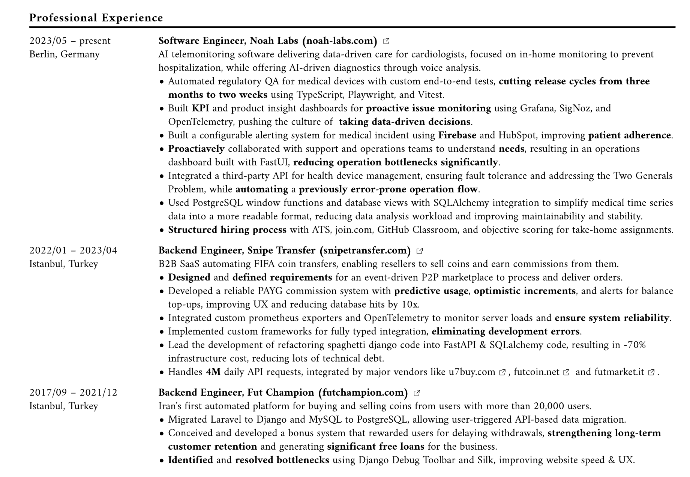

## Learn how to write a good bullet points for your work experience section

[The most important part of writing a working experience section is to write a good bullet points. Make sure to read that section first, before jumping on this section!](../guidelines/structure.md/#bullet-points)

## Why It Matters

The work experience section is often the most important part of your resume. It’s where you showcase your career progression, skills, and achievements in previous roles. This section helps potential employers see what you’ve done and how you can contribute to their organization.

## Key Guidelines

### 1. **Relevancy is Key**

Focus on including work experiences that are directly relevant to the job you’re applying for. If a past job isn’t related to the position, either leave it out or minimize its details. Tailor your work experience to match the job description, emphasizing roles and achievements that align with what the employer is looking for.

### 2. **Chronological Order**

List your work experience in reverse chronological order, starting with your most recent job. This format is preferred by most recruiters because it shows your career progression and current skill set.

### 3. **Include Essential Details**

For each job, provide the following information:

- **Job Title**: Clearly state your position.
- **Company Name**: Include the full name of the company.
- **Location**: Mention the city and state where the company is based.
- **Dates of Employment**: Provide the start and end dates (month and year).

### 4. **Describe Your Role and Achievements**

Under each job, describe your main responsibilities and key achievements. Focus on what you accomplished rather than just listing duties. Quantify your achievements where possible (e.g., “Increased sales by 20%”).

### 5. **Address Career Gaps**

If you have gaps in your employment history, be prepared to address them. Consider using a functional or combination resume format if you have significant gaps or if you’re changing careers.

### 6. **How Far Back Should You Go?**

Generally, your work experience should cover the last 10-15 years. If you have a long career history, focus on the most recent and relevant roles. For senior positions, you may need to go back further, but always prioritize relevancy over chronology.

## Example:

Check the screenshot below

